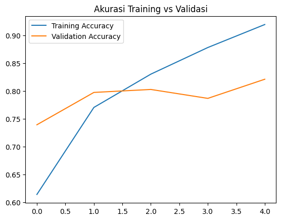

# Intel Image Classification 🧠🖼️

Saya sedang mempelajari **Convolutional Neural Network (CNN)** dan klasifikasi citra menggunakan dataset berikut:  
📦 [Intel Image Classification – by Puneet6060 (Kaggle)](https://www.kaggle.com/datasets/puneet6060/intel-image-classification)

---

## 🔍 Tentang Proyek

Model CNN ini dilatih untuk mengenali 6 kategori gambar:

- Buildings
- Forest
- Glacier
- Mountain
- Sea
- Street

Berikut hasil akurasi **training** dan **validasi** setelah pelatihan beberapa epoch:  


---

Untuk library, saya menggunakan:
````
tensorflow
numpy
scipy
protobuf
typing-extensions
pandas
matplotlib
````
